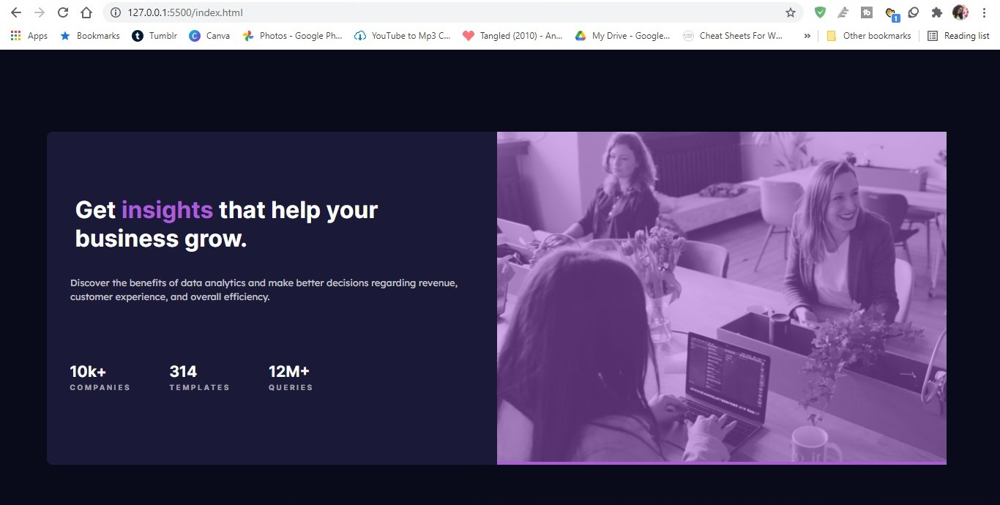

# Frontend Mentor - Stats preview card component solution

This is a solution to the [Stats preview card component challenge on Frontend Mentor](https://www.frontendmentor.io/challenges/stats-preview-card-component-8JqbgoU62). Frontend Mentor challenges help you improve your coding skills by building realistic projects. 

## Table of contents

- [Overview](#overview)
  - [The challenge](#the-challenge)
  - [Screenshot](#screenshot)
  - [Links](#links)
- [My process](#my-process)
  - [Built with](#built-with)
  - [What I learned](#what-i-learned)
  - [Continued development](#continued-development)
  - [Useful resources](#useful-resources)
- [Author](#author)
- [Acknowledgments](#acknowledgments)

**Note: Delete this note and update the table of contents based on what sections you keep.**

## Overview

### The challenge

Users should be able to:

- View the optimal layout depending on their device's screen size

### Screenshot




### Links

- Solution URL: [Add solution URL here](https://your-solution-url.com)
- Live Site URL: [Add live site URL here](https://your-live-site-url.com)

## My process

### Built with

- Semantic HTML5 markup
- CSS custom properties
- Sass
- Flexbox
- CSS Grid
- Mobile-first workflow


### What I learned

I've learned the iportance of consice language. This was one of the most simple projects I have worked on. Instead of overcoplicating it, I should have also used simple words. I didn't need as many div classes as I thought. When it comes to the stats list, I could have used strong. A

Using css grid would have made things easier by keeping it organized. I need to get better at using grid and flexbox properly.

I never worked with color overlays before, so it was a bit of a challenge for me. I was't sure how to remove the purple line for showing.


```css
.proud-of-this-css {
 .header-image {
    position: relative;
    
    
    #overlay {
        background: $primarycolor-violet;
        overflow: hidden;
        border-radius: 10px 10px 0 0;
        
    }
    
    img {
        object-fit: cover;
        opacity: 0.5;
        border-radius: 10px 10px 0 0;
    }
    
    
}
}
```


### Continued development

I want to focus on using css grid and flexbox. Use this section to outline areas that you want to continue focusing on in future projects. These could be concepts you're still not completely comfortable with or techniques you found useful that you want to refine and perfect.


### Useful resources

- [Example resource 1](https://www.example.com) - This helped me for XYZ reason. I really liked this pattern and will use it going forward.
- [Example resource 2](https://www.example.com) - This is an amazing article which helped me finally understand XYZ. I'd recommend it to anyone still learning this concept.


## Author

- Website - [Add your name here](https://www.your-site.com)
- Frontend Mentor - [@shannellassem](https://www.frontendmentor.io/profile/yourusername)
- Twitter - [@yourusername](https://www.twitter.com/yourusername)


